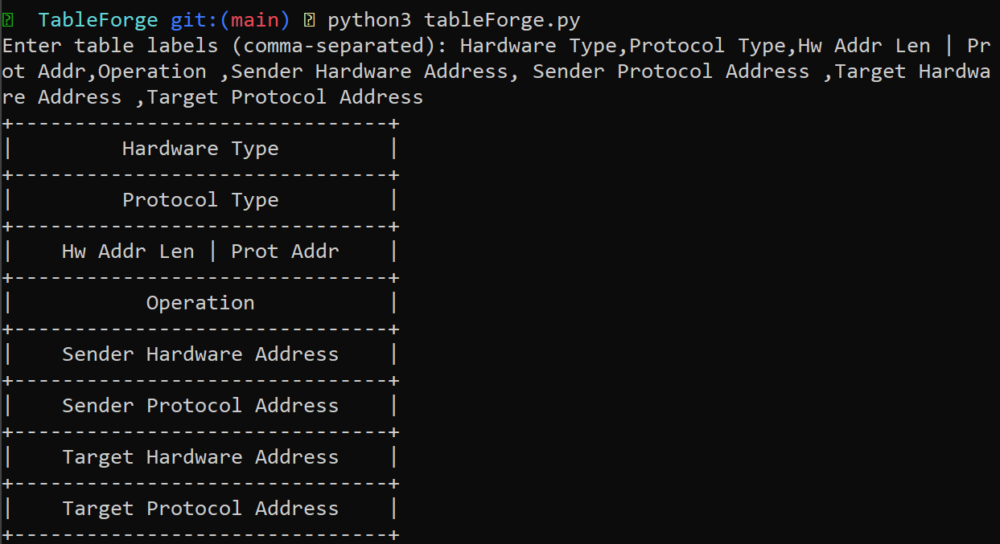

# TableForge

## Description

This Python program prompts the user to enter a list of labels separated by commas.<br />
It then generates a table with centered labels, where each label is surrounded by a border of dashes.<br />
The table is displayed in the console, providing a visually appealing representation of the input labels.

## Command

```
python3 tableForge.py
```

## Screenshot

<p align="center">
        
        <span><i>Example with the ARP packet</i></span>
</p>
